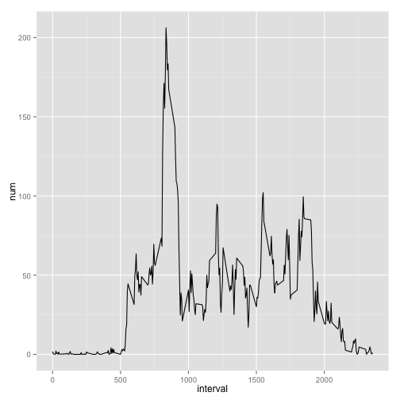
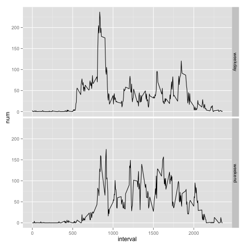

# Reproducible Research: Peer Assessment 1

## Loading and preprocessing the data

First let us load the data inro R (we are assuming that
the data have been unzipped). Besides, 
we'll add week days to the data
because we are going to use week days later in our analysis
anyway. At the same time, we'll load the libraries.


```r
library(plyr)
library(ggplot2)
raw.data <- read.csv("activity.csv")
raw.data$week.day <- format(as.Date(raw.data$date), format="%a")
```

## What is mean total number of steps taken per day?

We are going to create a new data set with 
the mean and the median number of steps per day.
We'll use the function *ddply* from the library *plyr*.
The new data frame *total.steps* has the following columns:

- *date*

- *total* - the overall number of steps

To ignore the missing values (as required in the assignment),
we set the option "na.rm=TRUE".
Then we plot a histogram of the total number of
steps. Since we essentially replaced missing values
with zeroes (because we just skipped them when calculating
the sum), a large amount of zeroes in the histogram
has been generated.


```r
total.steps <- ddply(raw.data, .(date), summarize, 
                     total=sum(steps,na.rm=TRUE))
hist(total.steps$total,breaks=12,main="Data with missing values",
     xlab="total number of steps")
```

 

Now we calculate the mean and the median
of the total steps. 


```r
mean.and.median <- c(mean(total.steps$total),
                     median(total.steps$total))
mean.and.median
```

```
## [1]  9354 10395
```

The mean of the total number of steps per day (for days where it
is known) is 9354.2295 and the median is
1.0395 &times; 10<sup>4</sup>.

## What is the average daily activity pattern?

First, we create a data frame
called *average.steps* with
the following columns

* *interval* - a 5-minutes interval

* *num* - average number of steps for the given interval across all days.

At the same time, *most.active* is the interval 
with most average steps across all days.


```r
average.steps <- ddply(raw.data, .(interval), summarize, 
                       num=mean(steps,na.rm=TRUE))
most.active <- which.max(average.steps$num)
qplot(interval,num,geom="line",
      data=average.steps)
```

 

The interval with most steps on the average is
835.

## Imputing missing values

We are going to calculate the average
for this interval per week day and use it to 
replace missing values.

1. To calculate the total number of missing values
in the data set, we are only interested in
the column *steps*, so we'll use the function
*is.na*:

```r
no.missing.values <- sum(is.na(raw.data$steps))
```

The number of missing values is 2304.

2. We calculate the average number of
steps for each interval and week day and replace missing
values with the average for the same interval and the 
same week day. The resulting data frame is *average.steps*.


```r
average.steps <- ddply(raw.data, .(interval, week.day), summarize, 
                       num=mean(steps,na.rm=TRUE))
```

3. We create a new data frame called *complete.data*, 
copy *raw.data* into it, and then 
replace all missing values in the for loop.


```r
complete.data <- raw.data
for (i in 1:nrow(complete.data)) {
        if (is.na(complete.data$steps[i])) {
                I <- complete.data$interval[i]
                D <- complete.data$week.day[i]
                tmp <- subset(average.steps,
                              (week.day==D)&(interval==I))
                complete.data$steps[i] <- tmp$num
        }
}
```

4. Now we make a histogram of the
data with missing values that have been filled in.


```r
total.steps <- ddply(complete.data, .(date), summarize, 
                     total=sum(steps,na.rm=TRUE))
hist(total.steps$total,breaks=12,
     main="Data with missing values filled in",
     xlab="total number of steps")
```

 

Now we'll calculate the mean and the median of
the data with missing values filled in:


```r
new.mean.and.median <- c(mean(total.steps$total,na.rm=TRUE),
                     median(total.steps$total,na.rm=TRUE))
new.mean.and.median
```

```
## [1] 10821 11015
```

Now the mean of the total number of steps per day 
is 1.0821 &times; 10<sup>4</sup> and the median is
1.1015 &times; 10<sup>4</sup>. 

Recall that for the data with missing values,
the mean was 9354.2295 and the median was
1.0395 &times; 10<sup>4</sup>. 

As we see, both the mean and the median 
became bigger and a lot of zeroes have been gone 
as can be seen from the comparison of 
the two histograms.
My explanation is that
ignoring the missing values in the first part of
the assignment, we essentially replaced them with zeroes. 
Now we replaced missing values with positive numbers instead,
so, obviously, they grew on the average.

## Are there differences in activity patterns between weekdays and weekends?

First, we are going to add a factor column called *day*
to the data frame *complete.data*. There could be a better
way to do it, but I haven't been getting much sleep recently
and now it's too late and I really need to submit it and
go to bed:


```r
complete.data$day <- complete.data$week.day
complete.data[complete.data$week.day=="Mon",]$day <- "weekday"
complete.data[complete.data$week.day=="Tue",]$day <- "weekday"
complete.data[complete.data$week.day=="Wed",]$day <- "weekday"
complete.data[complete.data$week.day=="Thu",]$day <- "weekday"
complete.data[complete.data$week.day=="Fri",]$day <- "weekday"
complete.data[complete.data$week.day=="Sat",]$day <- "weekend"
complete.data[complete.data$week.day=="Sun",]$day <- "weekend"
complete.data$day <- factor(complete.data$day)
```

Now we'll calculate the average number 
of steps per day, factoring by weekend/weekday and then
plot the result.


```r
average.steps <- ddply(complete.data, .(interval, day), summarize, 
                       num=mean(steps,na.rm=TRUE))
qplot(interval,num,geom="line",
      data=average.steps,facets=day~.,)
```

 
